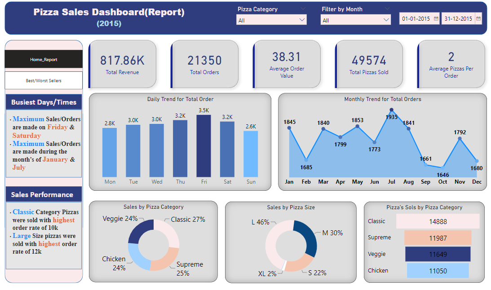
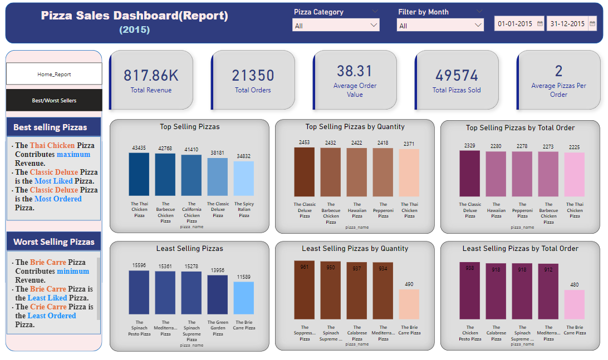

# Pizza Sales Report with SQL and Power BI

Welcome to the **Pizza Sales Report** project, where we leverage SQL for data analysis and Power BI for creating interactive visualizations. This project provides in-depth insights into pizza sales data, including daily and monthly trends, sales by pizza category and size, and identifying top-selling pizzas based on revenue, quantity, and total orders.

## Table of Contents

- [Features](#features)
- [Getting Started](#getting-started)
- [Data Analysis with SQL](#data-analysis-with-sql)
- [Creating Dashboards with Power BI](#creating-dashboards-with-power-bi)
- [Dashboard Overview](#dashboard-overview)
- [How to Use the Dashboard](#how-to-use-the-dashboard)
- [Contributors](#contributors)
- [Feedback and Contributions](#feedback-and-contributions)
- [License](#license)

## Features

- **Daily and Monthly Trends**: Visualize the total number of pizza orders and sales figures on a daily and monthly basis. Gain insights into when the highest sales occurred.

- **Pizza Category Analysis**: Analyze sales by pizza category to understand customer preferences and identify the most popular categories.

- **Pizza Size Analysis**: Examine the distribution of pizza sales by size, enabling you to tailor your menu based on customer choices.

- **Top-Selling Pizzas**: Discover the top-selling pizzas based on revenue, quantity, and total orders. Use this information to optimize your menu and increase profits.

## Getting Started

1. **Data Analysis with SQL**:
   - The initial data analysis was conducted using SQL. The SQL scripts and queries used for data extraction, transformation, and loading can be found in the <a href="pizza_sales_analysis.sql">sql_sales_analysis.sql</a> of this repository.

2. **Creating Dashboards with Power BI**:
   - The Power BI project file <a href="pizza_sales_report.pbix">pizza_sales_report.pbix</a> contains the interactive dashboards. You can open and customize it with Power BI Desktop.

3. **Access the Dashboard**:
   - Open the `pizza_sales_report.pbix` file with Power BI Desktop to explore the interactive dashboards.

## Data Analysis with SQL

The SQL analysis involved the extraction and transformation of the data, which includes details of pizza sales, pizza category, size, and featuring various KPI's. The SQL analytics include:
   - Identifying the daily and monthly trends of the pizzas sold and the revenue generated.
   - Identifying the top-selling pizzas based on revenue, quantity, and total orders.
   - Identify the least-selling pizzas based on revenue, quantity, and total orders.
   - Identifying the % of sales by pizza category and orders placed by the customers.

## Creating Dashboards with Power BI

Power BI is used to create interactive dashboards for visualizing the pizza sales data. The Power BI project file (`pizza_sales_report.pbix`) contains the following interactive dashboards:

### Dashboard Overview

The **Pizza Sales Report** dashboards provide a user-friendly interface and offer the following views:

- **Trends**: Daily and monthly sales trends.
- **Pizza Category Analysis**: Sales breakdown by pizza category.
- **Pizza Size Analysis**: Distribution of sales by pizza size.
- **Top-Selling Pizzas**: Identification of top-selling pizzas based on various metrics.
- **Least-Selling Pizzas**: Identification of least-selling pizzas based on various metrics.

### Home Page Report Dashboard

### Best/Worst Sellers Report Dashboard

### How to Use the Dashboard

1. **Open Power BI Desktop**:
   - Install [Power BI Desktop](https://powerbi.microsoft.com/desktop/) if you haven't already.

2. **Open the Project File**:
   - Launch Power BI Desktop and open the `pizza_sales_report.pbix` file.

3. **Explore the Dashboards**:
   - Navigate between the different views by clicking on the tabs on the left side.

4. **Interact with Visuals**:
   - The visuals are interactive; you can hover, click, and filter the data to gain deeper insights.

## Contributors

- [Bharath Guntreddi](https://github.com/bharathguntreddi3) - Project Creator and Maintainer

## Feedback and Contributions

We welcome your feedback, suggestions, and contributions to this project. If you have ideas for improvements, find issues, or would like to add new features, please don't hesitate to open an issue or submit a pull request. Your contributions are highly appreciated!

## License

This project is licensed under the MIT License - see the [LICENSE](LICENSE) file for details.

---

Explore the **Pizza Sales Report** to make informed decisions, optimize your menu offerings, and drive your pizza business to success. Thank you for choosing our tool!

If you find this project interesting and useful, show your support by starring ⭐ the repository and sharing it with others. Let's revolutionize productivity together!

## If any necessary commits are required to increase the elegance of this repo! I'm always open for a PR.

## With this signing off..!!, BHARATH GUNTREDDI ..🤞